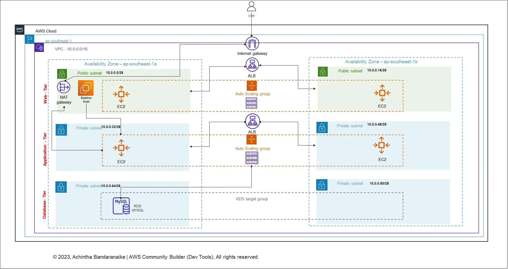

# Deploy a Highly Available Three-Tier Architecture in AWS using Terraform
## Introduction
This repository provides a Terraform configuration to deploy a highly available three-tier architecture in AWS. The architecture consists of an EC2 Auto Scaling group for the web tier and app tier, an RDS MySQL database for the data tier, and a bastion host for secure remote access.

## Architecture Diagram

## Architecture Overview
The three-tier architecture includes the following components:
+ VPC with CIDR 10.0.0.0/16
+ 2 public subnets with CIDR 10.0.0.0/28 and 10.0.0.16/28 in different Availability Zones
+ 4 private subnets with CIDR 10.0.0.32/28, 10.0.0.48/18 for the application tier and CIDR 10.0.0.64/28, 10.0.0.80/28 for the database tier in different Availability Zones
+ RDS MySQL instance
+ Application load balancer for directing traffic to public subnets and handling traffic from web tier to app tier
+ EC2 Auto Scaling group in each public subnet (web tier) and private subnet (app tier)
+ Internet Gateway, NAT gateway, and Elastic IPs for EC2 instances
+Bastion host for secure remote access to app servers

## Prerequisites
+ AWS account with IAM user access
+ Code Editor (e.g., VS Code)
+ Familiarity with Linux commands, scripting, and SSH
+ Reference: https://registry.terraform.io/

## Getting Started
+ Clone this repository to your local machine.
+ Install Terraform and configure your AWS credentials.
+ Review and update the Terraform configuration files as needed.
+ Run terraform init to initialize the Terraform working directory.
+ Run terraform apply to deploy the infrastructure.

## Contributing
Contributions are welcome! If you'd like to contribute to this repository, please fork the repository and submit a pull request with your changes.

## License
This repository is licensed under the MIT License. See LICENSE for details.

## Acknowledgments
Terraform: https://www.terraform.io/

AWS: https://aws.amazon.com/
